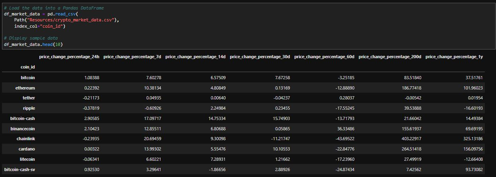
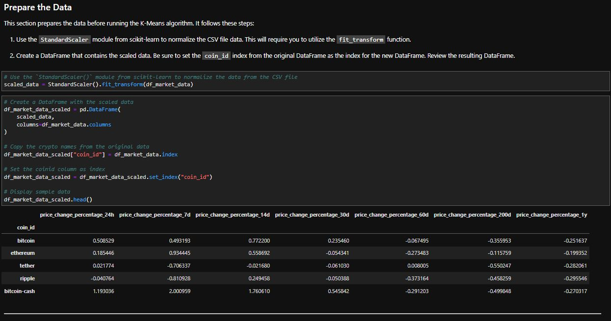
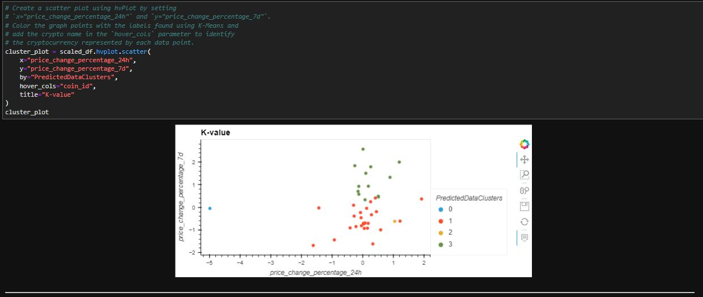
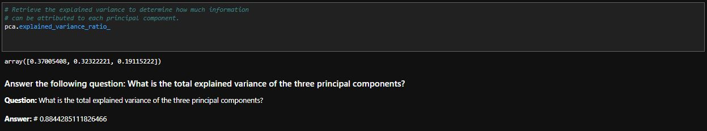
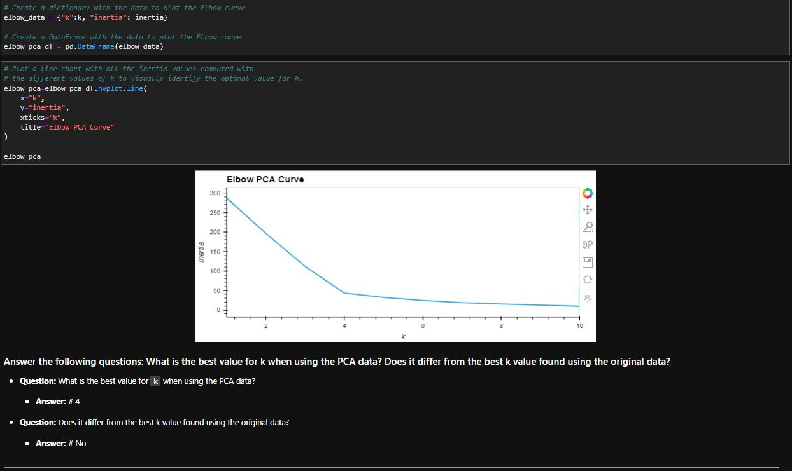
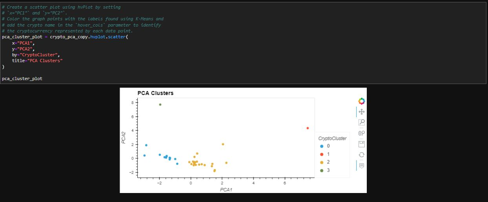
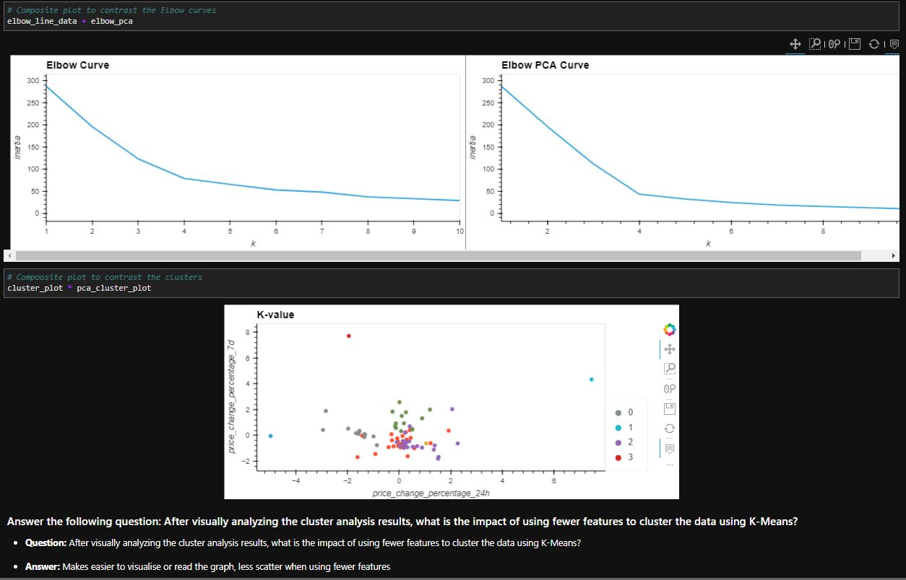

# Application

## Challenge: Crypto Clustering

In this Challenge, you’ll combine your financial Python programming skills with the new unsupervised learning skills that you acquired in this module.

The CSV file provided for this challenge contains price change data of cryptocurrencies in different periods.

The steps for this challenge are broken out into the following sections:

* Import the Data (provided in the starter code)
  
* Prepare the Data (provided in the starter code)
  
* Find the Best Value for `k` Using the Original Data
  
* Cluster Cryptocurrencies with K-means Using the Original Data
  
* Optimize Clusters with Principal Component Analysis
  
* Find the Best Value for `k` Using the PCA Data
  
* Cluster the Cryptocurrencies with K-means Using the PCA Data
  
* Visualize and Compare the Results
  
